<p align="center">
  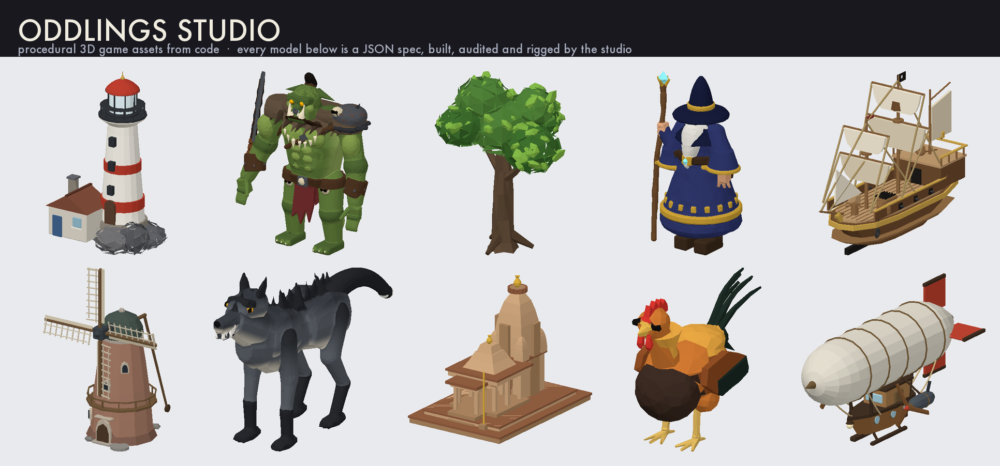
</p>

<p align="center">
  <a href="LICENSE"></a>
  
  
  
  
</p>

# Oddlings Studio

Procedural 3D game assets generated entirely from local code — creatures, people, props and environments, rigged and exported as glTF for Unity, Godot and the web. No model API, no generated media, no network request. The same seed always produces the same geometry, down to identical bytes.

There are three ways in:

| Surface | For | Entry point |
| --- | --- | --- |
| **MCP server** | AI agents | `npm run mcp` |
| **CLI** | scripts, CI, batch runs | `npm run oddlings -- <command>` |
| **Studio** | humans, previewing and tweaking | `npm run dev` |

All three share one geometry, rigging and export pipeline, so a creature an agent generates is byte-identical to one you make by hand.

## Quick start

Node 22.13 or newer.

```bash
npm install
npm run oddlings -- generate guardian --seed 7 --out ./assets --format glb,unity
npm run oddlings -- new creature --rig quadruped > specs/beast.spec.json   # a starter that audits clean
npm run oddlings -- render specs/beast.spec.json --out ./shots             # PNGs, no browser
```

## For agents

### MCP

Point an MCP client at `npm run mcp` (stdio). The repo ships a `.mcp.json`, so inside this directory Claude Code picks the server up automatically.

```json
{
  "mcpServers": {
    "oddlings": { "command": "npx", "args": ["tsx", "mcp/server.ts"] }
  }
}
```

Twelve tools:

| Tool | What it does |
| --- | --- |
| `list_blueprints` | The 15 built-in generators and the kind each produces |
| `generate_from_blueprint` | Blueprint + seed → files on disk, plus the editable recipe |
| `mutate_recipe` | A deterministic sibling of an existing recipe |
| `get_spec_guide` | Authoring guide, JSON Schema, shape list and a worked example |
| `spec_template` | A starter spec for a creature (humanoid or quadruped), person, prop, mechanism or environment that already audits clean |
| `build_from_spec` | An asset you authored yourself, from primitives up |
| `audit_spec` | Check geometry without writing files — floating parts, rig problems; `visual: true` adds what it looks like |
| `render_spec` | PNGs of the model from named views, in a few hundred milliseconds |
| `measure_spec` | Bounding boxes, gaps between parts, which bone owns what |
| `inspect_asset` | Read a written `.glb` back: triangles, bones, chains, animation clips |
| `review_notes` / `resolve_note` | Read the notes a human left in the studio, close each with a reply |

Every write returns the files it produced, the measured triangle, mesh, material and bone counts, **and a geometry audit**, so an agent can iterate against numbers instead of guesses. `inspect_asset` closes the loop by reading the file back off disk.

### The audit

Nothing renders the asset, so the checks have to stand on their own. `audit.ok` is false only for defects worth acting on:

| Code | Severity | What it catches |
| --- | --- | --- |
| `detached-part` | error | Copies of a part left hanging in mid-air, reported as "5 of 6 buds" rather than as a whole part — a repeat can land four blossoms in the foliage and two above it |
| `degenerate-part` | error | Geometry too small to see |
| `rig-scale` | error | A model outside the 0.7–1.5 m band automatic weighting is tuned for, while parts still rely on it |
| `rig-head-heavy` | error | Head-bound geometry spanning more than 40% of the model's height — the body will swing with the head |
| `rig-no-legs` | warn | Nothing bound to a leg, so walk and jump move nothing below the hips |
| `open-shell` | error | The mesh has holes — edges with only one triangle on them |
| `detached-shell` | error | A surface asset fell into pieces; one shell floats free of the body |
| `components`, `connected`, `one-shell`, `proportions` | info | Silhouette from each axis, and whether the model is one piece |

Contact is measured from the smaller mesh's surface samples to the larger mesh's faces, never point-to-point, so a window sunk into a tower is not called adrift just because the tower is sampled coarsely. A surface-mode asset is a single mesh, so there is nothing to compare — connectivity is answered exactly from the topology instead, with no tolerance to guess at. There is deliberately **no** "part is buried inside another" check: eyes sit inside heads and pegs inside sockets, so it would flag correct work far more often than mistakes, and a report that has to be ignored is worse than none.

In the studio the same findings appear in the properties panel; click one to select the part it names.

### Two ways to make something

**Blueprints** sample values inside a built-in generator. Fast, always plausible, but the silhouette family is fixed.

```
generate_from_blueprint { blueprint: "guardian", seed: 7 }
```

**Specs** describe the asset itself — a tree of primitives with transforms, colors, seeded jitter, mirrors, repeats and rig bindings. Use a spec when no blueprint covers the shape you need.

```jsonc
{
  "version": 1,
  "name": "Guardian",
  "kind": "creature",
  "seed": 42,
  "rig": { "hipHeight": 0.5, "headPivot": 0.95, "shoulderWidth": 0.3 },
  "parts": [
    {
      "name": "head",
      "shape": "icosahedron",
      "size": [0.62, 0.58, 0.6],
      "position": [0, 1.02, 0],
      "jitter": 0.3,
      "rigPart": "head",
      "children": [
        { "shape": "sphere", "size": [0.13, 0.13, 0.13],
          "position": [0.15, 0.05, 0.27], "color": "#1d2321", "mirror": "x" }
      ]
    },
    { "shape": "limb", "from": [0.26, 0.8, 0], "to": [0.42, 0.42, 0.06],
      "radius": 0.075, "rigPart": "arm_l", "mirror": "x" }
  ]
}
```

Worked examples in [`specs/`](specs), none of which any blueprint could produce. Every image is the studio's own `render` of the spec beside it:

| | Spec | What it exercises |
| --- | --- | --- |
| 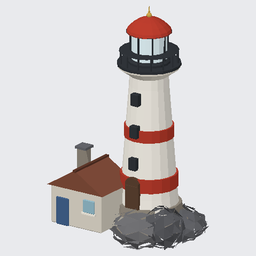 | [`lighthouse`](specs/lighthouse.spec.json) | a 32-part faceted prop: a lathed tower, banded by a `repeat` with `scaleStep`, a radial railing, a `material` emissive lamp, and one `joints` chain turning the lens |
| 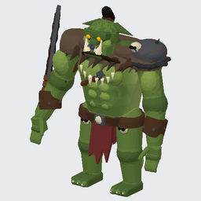 | [`orc-warchief`](specs/orc-warchief.spec.json) | rigged humanoid, 118 parts: lofts, lathes, `paint` expressions and `material` presets, layered armour, fused at 16k triangles |
| 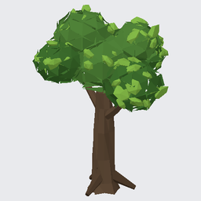 | [`oak-tree`](specs/oak-tree.spec.json) | the shortest spec here, and the one to copy first: a jittered lathe trunk, `limb` roots and branches, and 80 leaves dropped by `repeat: { mode: "surface" }` |
| 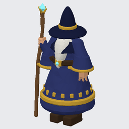 | [`wizard`](specs/wizard.spec.json) | rigged humanoid: lathed robes, mirrored features, seeded `jitter` |
| 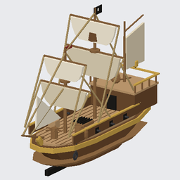 | [`pirate-ship`](specs/pirate-ship.spec.json) | a 63-part prop: lathed hull, mirrored rigging, repeats, taper |
| 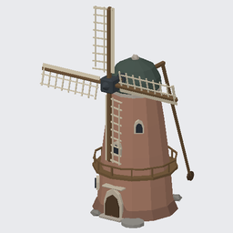 | [`windmill`](specs/windmill.spec.json) | taper, a repeat on the sails, two `joints` with spin clips that turn them |
| 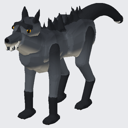 | [`dire-wolf`](specs/dire-wolf.spec.json) | a `rig: { "kind": "quadruped" }` creature: every part pinned by hand — the legs to their hip/knee/ankle chains, the rest to `body` — with hackles laid down the spine by `repeat: { mode: "along" }` and the whole thing fused at 12k triangles |
| 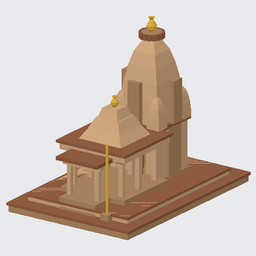 | [`hindu-temple`](specs/hindu-temple.spec.json) | architecture: lathed towers, mirrored wings, repeated columns and steps |
| 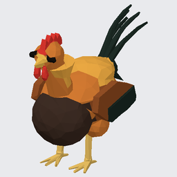 | [`rooster-lowpoly`](specs/rooster-lowpoly.spec.json) | a 27-part creature fused at a deliberately tiny 1,900-triangle budget |
| 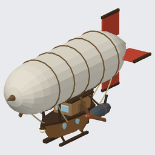 | [`airship`](specs/airship.spec.json) | a 43-part prop: a lathed envelope with repeated rib bands, a `defs` porthole placed by three mirrored `use` sites, sagging `via` ropes and two propellers on `joints` that turn |
| 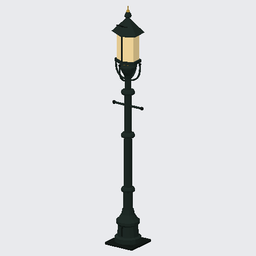 | [`street-lamp`](specs/street-lamp.spec.json) | a small prop done properly: lathe, mirror, repeat, a `material` preset |
| 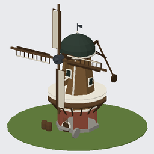 | [`smock-mill`](specs/smock-mill.spec.json) | a 69-part building with two joints and a `rest` placement |

More in [`specs/`](specs): a [`grave-knight`](specs/grave-knight.spec.json), a [`rune-knight`](specs/osrs-knight.spec.json), a [`sniper-rifle`](specs/sniper-rifle.spec.json), the [`taj-mahal`](specs/taj-mahal.spec.json), a [`naval-destroyer`](specs/naval-destroyer.spec.json), an eight-legged [`octopod-walker`](specs/octopod-walker.spec.json). A handful of plainer specs in the same folder are test fixtures rather than showpieces.

Call `get_spec_guide` (or `npm run oddlings -- schema`) for the complete schema.

Worth knowing when authoring:

- **Units.** Y up, +Z front, one unit is one metre. `size` is the bounding box a shape is fitted to, so a sphere sized `[0.6, 0.4, 0.6]` is a squashed ball.
- **Children are relative.** A child's `position` is an offset from its parent, not a world coordinate. Writing world coordinates there is the quickest way to get a model twice as tall as you meant. `limb`'s `from`/`to` are already in the parent's frame.
- **`mirror`** duplicates a part on the other side and swaps its `_l` / `_r` rig binding — author one arm, not two. It reflects children too.
- **`repeat`** arrays a part: `linear` steps by `offset` and `rotation`, `radial` orbits an axis across an `arc`. Teeth, spikes, fingers, fence posts. Up to 512 copies from one repeat — enough for a canopy of individual leaves; the 4,000-mesh ceiling is the real limit and fails by name.
- **`repeat: { mode: "surface" }`** drops copies onto the surface of whatever is authored before them — blossoms on a bush, barnacles on a hull, rivets on a tank. `band` limits it to a height slice of the body, `embed` sinks each copy in. No radius to guess, which matters: a radius wide enough to clear a body's widest point leaves copies hanging in the air wherever it narrows, and that one mistake causes most floating parts.
- **`scatter` / `twist` / `sizeJitter`** on a repeat add seeded irregularity — a random offset, rotation and size per copy. A plain repeat reads as machined; anything grown needs these. Reproducible from the spec seed.
- **`jitter`** (0.1–0.4) erodes a shape along its normals with seeded noise. A jittered sphere reads as a rock; a jittered cylinder as a weathered trunk.
- **`detail`** stays low (4–8). The look is faceted and flat-shaded on purpose.
- **Rigging is mostly automatic.** Parts without a `rigPart` are weighted by where their centre sits, against fixed thresholds: above y 0.82 binds to the head, below y 0.36 to the nearer leg, wider than 0.28 from the centre line to the nearer arm, the rest blends hips to spine. Those suit a character roughly 1–1.3 m tall — build at that scale and use the top-level `scale` field for giants and gnomes. Outside that range, set `rigPart` on every part.

### One mesh, not a pile of shapes

By default every part exports as its own closed solid. That is a kitbash: the
faces buried inside the body cost triangles nothing can see, there is no single
surface to unwrap, and the solids slide apart from each other when the rig
bends them.

Add a `surface` block and the same parts become a signed distance field
instead — blended together, sampled on a grid, and re-meshed into **one
continuous manifold polygon mesh**. Nothing else about the spec changes.

```jsonc
"surface": { "blend": 0.03, "detail": 128, "budget": 6000, "shading": "flat" }
```

| Field | What it does |
| --- | --- |
| `blend` | How softly parts melt together, in metres. Closes gaps up to **half** its own width, so `0.06` fuses parts sitting 3 cm apart. `0` welds them with a hard crease. |
| `detail` | Sampling resolution along the longest axis. Raise it to resolve small features; a 3 cm tooth is invisible at `64`. |
| `budget` | Triangle count the mesh is decimated to, so you get a game budget rather than whatever the grid produced. |
| `shading` | `flat` keeps the faceted look at a low budget; `smooth` reads as a sculpt and wants a higher one. |

The kaiju, same spec both ways:

| | Meshes | Materials | Triangles | Build |
| --- | --- | --- | --- | --- |
| Faceted | 60 | 5 | 1,308 | 11 ms |
| Surface, `detail: 144`, `budget: 6000` | **1** | **1** | 6,000 | 156 ms |

Surface mode also changes three things downstream. Part colours become vertex
colours on the single mesh, so the whole asset is one draw call — and because
OBJ has no vertex colours, the `.obj`/`.mtl` reads its colour from the baked
atlas instead, or from the spec's base colour when there is no atlas to read. Skin weights are assigned
per vertex from the part each vertex came from, rather than per mesh, so a
single body mesh still binds its head to the head bone and its shins to the
shins. And a part's own `detail` stops mattering, because parts are never
triangulated — resolution comes from `surface.detail` instead.

The mesh is always closed: every edge has two triangles, so there are no holes
for a collider or a shadow to leak through. It is not always *manifold* — one
vertex per grid cell cannot describe a crease that cuts diagonally through that
cell, so a knife-edged shape at `blend: 0` pinches into a handful of
non-manifold edges along its creases. Raising `detail` does not help; blending
rounds the crease away, which is the point of the mode.

Use it for anything organic or anything that deforms. Leave it off for
hard-surface props and architecture, where crisp separate primitives are the
point.

## CLI

```bash
npm run oddlings -- blueprints
npm run oddlings -- generate scout --seed 42 --out ./Assets/Creatures --format glb,unity
npm run oddlings -- mutate ./assets/scout.recipe.json --seed 99 --strength 0.6
npm run oddlings -- new creature --rig quadruped
npm run oddlings -- build ./specs/lantern-keeper.spec.json --format glb,obj
npm run oddlings -- audit ./specs/flower-bush.spec.json --visual
npm run oddlings -- render ./specs/kaiju.spec.json --views front,side,three-quarter
npm run oddlings -- measure ./specs/kaiju.spec.json --parts head,tail
npm run oddlings -- notes ./specs/kaiju.spec.json
npm run oddlings -- inspect ./assets/lantern-keeper.glb
npm run oddlings -- schema
```

`--json` prints machine-readable output for scripting, and `--strict` exits non-zero when the audit finds an error, which is what you want in CI. Formats are `glb` (rigged mesh with clips), `obj` (static mesh + `.mtl`), `unity` (zip of both plus import notes) and `json` (the editable recipe or spec).

## Studio

```bash
npm run dev     # http://localhost:3000
```

Blueprint buttons, sliders for every generator parameter, undo/redo, a local library, turntable and wireframe previews, and the five animation clips playing on the rig.

### Watching an agent work

Open `http://localhost:3000` with no arguments and the studio shows **whatever
was built last** and keeps up as that changes. Every `writeAsset` — so every
CLI `build`, `generate` and `mutate`, and the MCP `build_from_spec` — plus the
CLI `audit` writes a pointer to `.oddlings/active.json` with the asset embedded.
The studio polls its ETag once a second and reloads when it moves.

So an agent iterating in a terminal drives the viewport on your screen, and you
never import a file:

```bash
oddlings audit specs/bone-revenant.spec.json   # studio switches to it
# edit the spec, run it again                  # viewport updates in place
oddlings build specs/kaiju.spec.json --out ./assets   # studio follows to assets/
```

A bar above the viewport says what is being followed and when it last changed.

- `?spec=<path>` pins the studio to one file instead — `?spec=specs/kaiju.spec.json`. Useful for a link to a specific asset.
- **Following is one-way.** The moment you edit anything in the studio it detaches, the bar says so, and the file stops overriding you. Two writers on one document is a fight nobody wins. **Follow the latest build** re-attaches.
- Reloads never *add to* undo history; only the first attach records a step, so you can always undo back behind it. Following a switch from one asset to another does leave the previous one in the history.
- None of this exists in a deployed build — the fetches 404 and the studio behaves exactly as it always did.

MCP's `audit_spec` deliberately does *not* write the pointer: it is annotated
read-only, and an annotation that lies is worse than a missing feature. Use the
CLI `audit` for the live loop, or `build_from_spec` to write and preview at once.

**Import recipe or spec** accepts either file. Load a spec an agent wrote and the studio becomes an editor for it:

- **Part tree** — every authored part, nested, with the number of meshes each expands into (`×15` for a repeated blossom). Select one and it's outlined in the viewport, every copy of it at once.
- **Inspector** — shape, name, size, position, rotation, colour, detail, erosion, taper, and the full repeat block including `scatter` / `twist` / `sizeJitter`. Typing updates the preview live; releasing commits one undo step.
- **Duplicate and delete** parts, and re-roll the scatter seed to reshuffle every scattered repeat at once — the fastest way to iterate on anything organic.
- **One undo history** spans both modes. Undo past your first spec edit and you're back on the recipe you had before you imported it; redo brings the spec and every tweak back.

That makes the studio the review step in an agent loop: the agent writes, you look, you fix the two things it got wrong, you export.

## Output

- **GLB** — scene hierarchy, skin weights, a Generic rig and its clips: the 14-bone humanoid with Idle, Walk, Jump, Wave and Attack, or a quadruped body with four hip/knee/ankle chains and Idle and Walk. A `joints` chain — a cape, a tail, a swinging sign — rides on either, or stands alone as a mechanism's whole skeleton. Unity needs a glTF importer such as [glTFast](https://github.com/Unity-Technologies/com.unity.cloud.gltfast). Treat the rig as Generic, not Humanoid.
- **OBJ + MTL** — static mesh, flat normals, and the baked maps wired through `map_Kd`, `map_Ke`, `norm`, `map_Pr` and `map_Pm`.
- **Unity zip** — both of the above plus the recipe or spec and import notes.
- **Recipe / spec JSON** — reopen in the studio, or feed back to `mutate_recipe` / `build_from_spec`.

A faceted build with no `rig` and no `joints` also exports **a node per part**,
named after the part, standing at its `position` and `rotation` with the
geometry centred on it — so the node's axes are the axes the part was authored
in, and `scene.getObjectByName('cylinder').rotation.y += step` turns a revolver
cylinder about the axis it was drawn on. Children nest under their parent's
node, so hinging a group of parts is one rotation on the node they hang from.
A `surface` block fuses the parts into one mesh and a skeleton flattens the
hierarchy, so those assets move on bones instead.

Every mesh carries a UV0 channel. An asset that paints its surface — a `paint`
expression or a `material` preset on any part — also ships a baked atlas: one
PNG per channel beside the OBJ, and the same images inside the GLB as
baseColorTexture, normalTexture, metallicRoughnessTexture and emissiveTexture.
A textured GLB drops its vertex colours, since glTF multiplies those into the
base colour and a file carrying both would show every pattern twice; an asset
of flat colours ships no images and keeps them. No colliders or LODs; generate
those in-engine.

## Development

```bash
npm test          # 800+ tests: determinism, validation, rigging, surfaces, export round-trips
npm run typecheck
npm run lint
npm run build
```

Layout:

```
lib/
  asset-recipe.ts        recipe type, limits, validation
  procedural-director.ts the 15 blueprints and the mutation operator
  three-world.ts         creature, person, prop and habitat generators
  asset-spec.ts          the from-scratch spec: schema, expansion, build
  spec-edit.ts           immutable part-tree edits addressed by path
  asset-rig.ts           humanoid and quadruped skeletons, auto skin weights, clips
  asset-joints.ts        joint chains: pivots, parents, spin clips
  asset-rig-extras.ts    the skeleton block written into the GLB
  asset-sdf.ts           the shapes as signed distance fields, `field` parts
  asset-surface.ts       surface mode: sample, march, decimate into one mesh
  asset-prefabs.ts       `defs` and reuse
  asset-render.ts        PNG renders without a browser
  asset-audit.ts         geometry checks: detachment, rig sanity, proportions
  asset-audit-visual.ts  what the model looks like, in words
  asset-audit-clips.ts   what each clip drives through
  draw-marks.ts          marks a reviewer draws on the viewport, as spec notes
  asset-build.ts         recipe → finished model, stats, OBJ bundle
  asset-bundle.ts        byte-level GLB and Unity-zip builders
  asset-export.ts        browser download wrappers
  node-shims.ts          FileReader shim so the exporters run under Node
node/write-asset.ts      write an asset to disk, read a GLB back
cli/oddlings.ts          the CLI
mcp/server.ts            the MCP server
```

Nothing under `lib/` except `asset-export.ts` touches the DOM, which is why the same code runs in the browser, in Node and under test.

## License

MIT — see [LICENSE](LICENSE). What changed in each cut is in [CHANGELOG.md](CHANGELOG.md).
